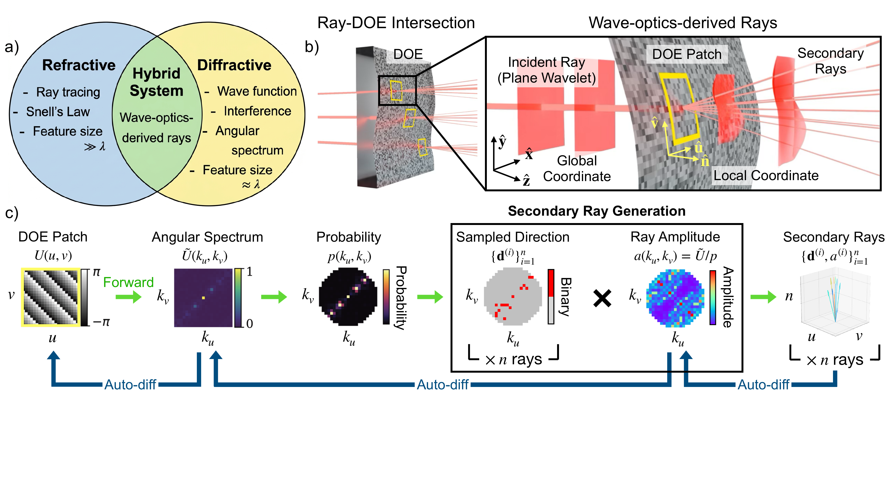
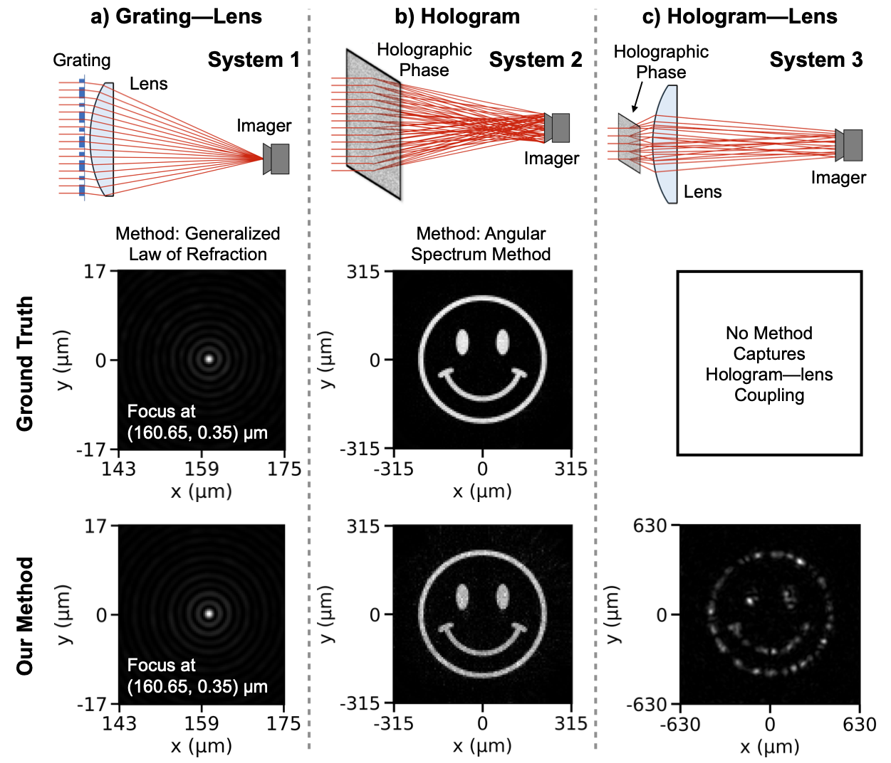
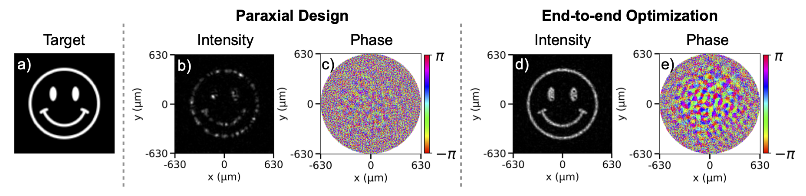
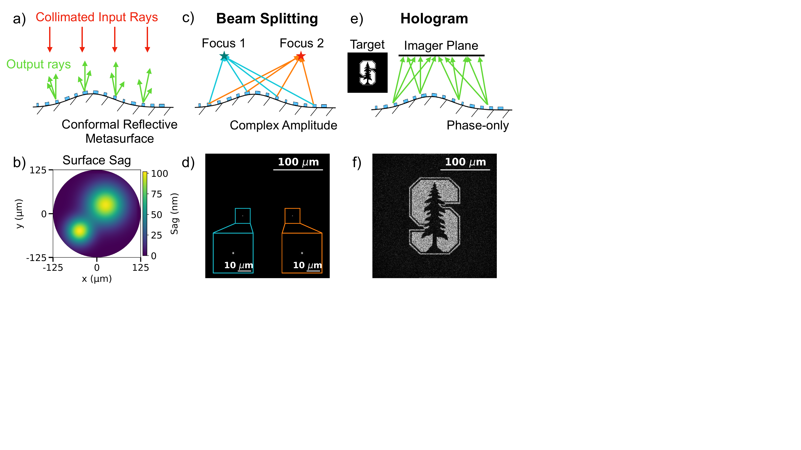

# Differentiable Ray–Wave Modeling for Hybrid Optical Systems

**Paper (ACS Photonics):** [A Differentiable Ray--Wave Framework for Hybrid Refractive--Diffractive System Modeling and Optimization]([https://doi.org/10.1021/acsphotonics.6c00818](http://pubs.acs.org/doi/abs/10.1021/acsphotonics.6c00818)

Hybrid refractive–diffractive systems are hard to model: rays and waves live at different spatial scales. This repo provides a **differentiable ray–wave** framework that plugs into standard ray tracing, supports **planar and curved** DOEs with arbitrary **holographic** / **complex-amplitude** profiles, and enables end-to-end inverse design.

<p align="center">
  
</p>

## Plug-and-play and lightweight implementation

Ray tracing builds on open-source [**DeepLens**](https://github.com/vccimaging/DeepLens) (`deeplens/`). Our plug-and-play ray–wave modules:

| Module | Role |
|--------|------|
| [`deeplens/raywave.py`](deeplens/raywave.py) | Huygens PSF / coherent sensor rendering from traced rays |
| [`deeplens/diffractive_surface/DoeRaywavePlane.py`](deeplens/diffractive_surface/DoeRaywavePlane.py) | Planar diffractive optical element (DOE) surface, full-field rule-of-thumb |
| [`deeplens/diffractive_surface/DoeRaywave.py`](deeplens/diffractive_surface/DoeRaywave.py) | General DOE with aspheric surface sag, patch-based implementation |

Standalone demos also use the lightweight package `src_lightweight/`.

---

## Benchmark (Fig. 5)

Three systems vs. conventional methods (λ = 0.7 µm): (a) grating + lens, (b) free-space hologram, (c) hologram + lens (no standard reference).

<p align="center">
  
</p>

| Setup | Reference | Result |
|-------|-----------|--------|
| (a) Grating + lens | Generalized refraction | MSE 1.5×10⁻⁹, NCC 0.985 |
| (b) Planar hologram | Angular spectrum (ASM) | MSE 4.4×10⁻¹⁰, NCC 0.997 |
| (c) Hologram + lens | — | Non-paraxial speckles missed by paraxial design |

Notebooks: [`fig5_benchmark/`](fig5_benchmark/) (DeepLens + `raywave`).

---

## Inverse design (Fig. 6 and 7)

### Fig. 6 — Hybrid flat DOE + lens

Paraxial design → NCC 0.462; end-to-end ray–wave optimization → **NCC 0.952**.

<p align="center">
  
</p>

```bash
python -m fig6_hybrid_system.optim   # configs/fig6_hybrid_system
```

### Fig. 7 — Conformal reflective DOE

Curved substrate (NA = 0.5, λ = 1 µm): two-focus beamsplitter and Stanford “S” hologram (NCC 0.909).

<p align="center">
  
</p>

```bash
python -m fig7_conformal_doe.optim_beamsplitter   # configs/fig7_beamsplitter
python -m fig7_conformal_doe.optim_hologram       # configs/fig7_hologram
```

---

## Layout

```
deeplens/              # DeepLens fork + ray–wave plug-ins
src_lightweight/       # standalone ray–wave primitives
fig5_benchmark/        # Fig. 5 notebooks
fig6_hybrid_system/    # Fig. 6 inverse design
fig7_conformal_doe/    # Fig. 7 conformal DOE
configs/               # demo configs (fig6_*, fig7_*)
figures/               # paper figures
```

## Citation

If you use this code, please cite:

```bibtex
@article{cheng2026differentiable,
  author  = {Cheng, Jiazhou and Gao, Margaret and Shao, Yixuan and Mao, Chenkai and Milster, Tom D. and Fan, Jonathan A.},
  title   = {A General Differentiable Ray--Wave Framework for Hybrid Refractive--Diffractive System Modeling and Optimization},
  journal = {ACS Photonics},
  year    = {2026},
  doi     = {10.1021/acsphotonics.6c00818},
  url     = {https://doi.org/10.1021/acsphotonics.6c00818},
  publisher = {American Chemical Society}
}
```

## Acknowledgment

This project uses [DeepLens](https://github.com/vccimaging/DeepLens) (Yang et al.) as the differentiable geometric ray-tracing backend for benchmark simulations.
